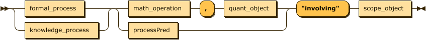
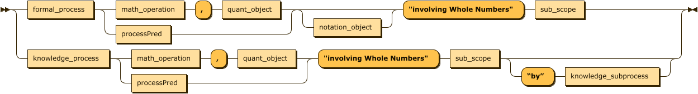

# Competency Generation XSLT - Process Documentation

Experimentation on competency formal grammar syntax rules and generation of competency data

## General competency syntax for all scopes:



[Click Here to see the Full Interactive Competency Grammar Syntax Diagram](https://am0eba-byte.github.io/competency_generation/)

**Table of Contents**
- [Competency Generation XSLT - Process Documentation](#competency-generation-xslt---process-documentation)
  - [General competency syntax for all scopes:](#general-competency-syntax-for-all-scopes)
- [**1st Processing Stage**: Competency Sentence Generation and Construction (**Part 1. Non-Whole Numbers**)](#1st-processing-stage-competency-sentence-generation-and-construction-part-1-non-whole-numbers)
  - [File Locations](#file-locations)
    - [The Input](#the-input)
      - [Math K-5 Competency Input (from Math team - no sentence generation required)](#math-k-5-competency-input-from-math-team---no-sentence-generation-required)
    - [XSLT Generator - raw unformatted XML file with competencies for each scope EXCEPT whole numbers:](#xslt-generator---raw-unformatted-xml-file-with-competencies-for-each-scope-except-whole-numbers)
  - [XML Output](#xml-output)
    - [Fully Prepared XML Seed Data Output (K-5) (not wholenums):](#fully-prepared-xml-seed-data-output-k-5-not-wholenums)
- [About the XSLT Competency Generators](#about-the-xslt-competency-generators)
    - [Global Component Params:](#global-component-params)
- [Generating Parent Competencies and Low-Level Competencies - Grouped Hierarchies](#generating-parent-competencies-and-low-level-competencies---grouped-hierarchies)
  - [Scope Filtering](#scope-filtering)
    - [Global Scope Params:](#global-scope-params)
  - [`xsl:key` Generator Implementations:](#xslkey-generator-implementations)
    - [How to use `xsl:key` and `xsl:param` to filter specific scope strings/handling instructions:](#how-to-use-xslkey-and-xslparam-to-filter-specific-scope-stringshandling-instructions)
    - [Example of a Filtering Variable using an `xsl:key`:](#example-of-a-filtering-variable-using-an-xslkey)
    - [How to filter a competency component by string AND scope - combining two `xsl:keys` with `INTERSECT`](#how-to-filter-a-competency-component-by-string-and-scope---combining-two-xslkeys-with-intersect)
        - [Scopes where xsl:key intersection filtering occurs](#scopes-where-xslkey-intersection-filtering-occurs)
    - [Example: Scope Key `INTERSECT` Notation Key](#example-scope-key-intersect-notation-key)
    - [Sentence Construction Combination Type Legend:](#sentence-construction-combination-type-legend)
      - [Formal Process Branch](#formal-process-branch)
      - [Knowledge Process Branch](#knowledge-process-branch)
- [Part 2. Whole Numbers Scope Competency Generation - Separate Workflow](#part-2-whole-numbers-scope-competency-generation---separate-workflow)
    - [Whole Numbers Scope competency syntax:](#whole-numbers-scope-competency-syntax)
    - [Whole Numbers Sub-Scope Set:](#whole-numbers-sub-scope-set)
  - [File Locations](#file-locations-1)
    - [The Input](#the-input-1)
    - [Whole Numbers Sentence Combination Group Legend](#whole-numbers-sentence-combination-group-legend)
      - [Formal Process Branch](#formal-process-branch-1)
      - [Knowledge Process Branch](#knowledge-process-branch-1)
    - [Global Whole Numbers Component Params:](#global-whole-numbers-component-params)
  - [Wholenums `xsl:key` Filtering](#wholenums-xslkey-filtering)
    - [Notation Object Filtering - Special Formal Process String Keys](#notation-object-filtering---special-formal-process-string-keys)
      - [How to use Notation Object key to filter Formal Process strings:](#how-to-use-notation-object-key-to-filter-formal-process-strings)
- [**2nd Processing Stage:** Seed Data JSON-Structure Conversion](#2nd-processing-stage-seed-data-json-structure-conversion)
  - [File Locations](#file-locations-2)
      - [The Input:](#the-input-2)
      - [The JSON-Structure Converter XSLTs:](#the-json-structure-converter-xslts)
      - [Formatted JSON-Strucured XML Output:](#formatted-json-strucured-xml-output)
  - [About the JSON-Structure Converters](#about-the-json-structure-converters)
    - [Structure Transformation Example](#structure-transformation-example)
- [**Final Processing Stage:** XML-to-JSON Conversion](#final-processing-stage-xml-to-json-conversion)
  - [File Locations](#file-locations-3)
    - [The Input](#the-input-3)
    - [The XML-JSON Converter XSLT](#the-xml-json-converter-xslt)
    - [Final JSON Output](#final-json-output)
  - [About the XML-JSON Converter XSLT](#about-the-xml-json-converter-xslt)
    - [Example of JSON transformation](#example-of-json-transformation)
- [Developer Notes](#developer-notes)
    - [Considerations](#considerations)
    - [Final Data Implementation](#final-data-implementation)
      - [Scope competencies generated so far](#scope-competencies-generated-so-far)
  - [Tools](#tools)

# **1st Processing Stage**: Competency Sentence Generation and Construction (**Part 1. Non-Whole Numbers**)

## File Locations

### The Input

- Competency sentence components input XML file: `competency_generation\competency_formal_grammar\XSLTgeneration\MERGEDcompetency_components.xml`

#### Math K-5 Competency Input (from Math team - no sentence generation required)
- **Grade K** input file at:
`competency_generation\competency_formal_grammar\hand-writtenComps\gradeK-comps.xml`


### XSLT Generator - raw unformatted XML file with competencies for each scope EXCEPT whole numbers:

- Location: `competency_generation\competency_formal_grammar\XSLTgeneration\transitiveParent-sepScopes-compgenerator.xsl`

## XML Output 
The XML output file for each scope competency is located within their respective scope folder names in this directory:

- Location: `competency_generation\competency_formal_grammar\XSLTgeneration\scope_output\[scope-name]\[scopeName]NestedOutput-TP.xml`


**NOTE:** not all of the scope comp XML files have been fully processed, so not all of them are ready for the next stage of conversion. See below.

**NOTE:** *so far only the **K-5** scopes have been fully processed with transitive IDs and transitive parent competencies, which can be found here:

###  Fully Prepared XML Seed Data Output (K-5) (not wholenums):

- Location:
`competency_generation\competency_formal_grammar\XSLTgeneration\scope_output\K5scopes\[scopeName]\[scopeName]NestedOutput-TP.xml`


# About the XSLT Competency Generators

The XSLT generator scripts have two basic components:
 1) **The `sentenceWriter` Named Template Function handles the sentence construction**: 
   
    - Governed by input parameters (`xsl:param`), which define the strings that line up with the element names of each competency sentence component in the XML source document.
 
     - In the function, we first create variables based on all of the possible input parameters, grapping their parent node name as a string. 

      -  Then it constructs a series of nested for-each loops and `<xsl:choose>` branches, which dictates how many sentence component elements can occur within an instance of a competency, depending on how many competency grammar sentence pieces are passed to it from the template rules.

      -  For example, if only two competency sentence chunks are sent by template, the function outputs a "sentence" consisting of two elements. 
    And if three parameters are in a sentence, the function outputs a "sentence" of three elements. 
    
     - The element names and order of elements within a given sentence depends on which "bucket" of words is passed to it within the `<xsl:call-template>` with a `<xsl:with-param>`. 
    
 1) **The Sentence Generator xsl:template Rules** (sends chunks to the Sentence writer): 
   
    - This is a template matching on the source document node and set to output groups of different kinds of sentences. 

     - These templates set up each combination of sentences we want, going one-by-one through a given competency component's bucket of strings within the source XML, and sending each string through the sentenceWriter template function in a particular order (based on the Competency Formal Grammar rules shown below)

     

     
      - There is one template for each type of sentence structure possibility, and a set of either four, six, or eight templates per scope. 
      
      - Each template uses `xsl:key` functions to filter through each component's `@class` attributes in the input and output only those who match the given scope param that is given.

     - Each sentence group needs an `<xsl:variable>` which grabs the `xsl:key` value of a specific scope param and generates an `<xsl:squence>` of the strings within a given component in the source document (pulled from the global parameters 
     defined at the top of the XSLT document) who are tagged with the given scope class attribute.

     - We use `<xsl:call-templates>` to invoke the named template function, and inside, we deliver
     what keyed variables we need to construct a sentence using `<xsl:with-param select="$keyedVariable">`. 
     
### Global Component Params:

These are the `<xsl:params>` that capture the buckets competency component strings, based on the name of the container element.
  
 ```
 <xsl:param name="formal_process" as="xs:string" select="'formal_process'"/>
 
    <xsl:param name="knowledge_process" as="xs:string" select="'knowledge_process'"/>
    
    <xsl:param name="processPred" as="xs:string" select="'processPred'"/>
    
    <xsl:param name="specificObject" as="xs:string" select="'specific_object'"/>
    
    <xsl:param name="math_operation" as="xs:string" select="'math_operation'"/>
    <xsl:param name="object" as="xs:string" select="'quant'"/> 
    
    <xsl:param name="notationObject" as="xs:string" select="'notationObject'"/>
   
```
**NOTE:**
-  The `specificObject` param is not used in competency sets keyed to specific scopes.
   -   All Specific Object competencies are generated once, with no filter rules.
 - The `notationObject` param is only used in three scopes: Rational Numbers, Integers, and Whole Numbers.
   -  `notationObejct` can only occur in competency sentences where there is a `formalProcess` component "Read" or "Write".
   -  See more about `xsl:key intersect` implementations in the Scope Filtering section below.
    

# Generating Parent Competencies and Low-Level Competencies - Grouped Hierarchies

All subsequent stages of processing the seed data depend upon a specific hierarchy of nested competency group nodes in order to properly identify, capture, and transform a parent competency, a sub-parent competency, and low-level competencies.

Here's an abridged overview of the XML data structure our competency generator XSLT should produce:

**NOTE: Following example is from wholenumsNestedParentOutput.xml** - *no other scopes will have kp-mathop-sp
knowledge subprocess 2nd-level parent nodes, but some will still contain the "fp" formal process notationParent sub-parent level nodes.*
```
<xml>
    <parent group="fp-pp">
        <parentGroup lvl="1>
            <!-- collection of top-level parent competencies here  -->
        </parentGroup>
        <compGroup>
            <!-- collection of 1st-level specific competencies here -->
        </compGroup>
        <notationParent group="fp-pp-no">
            <parentGroup lvl="2">
                <!-- collection of 2nd-level parent competencies here -->
            </parentGroup>
            <compGroup>
                <!-- collection of lowest-level specific competencies here -->
            </compGroup>
        </notationParent>
    </parent>
    <parent group="kp-mathop">
        <parentGroup lvl="1>
            <!-- collection of top-level parent competencies here  -->
        </parentGroup>
        <compGroup>
            <!-- collection of 1st-level specific competencies here -->
        </compGroup>
        <subParent group="kp-mathop-sp">
            <parentGroup lvl="2">
                <!-- collection of 2nd-level parent competencies here -->
            </parentGroup>
            <compGroup>
                <!-- collection of lowest-level specific competencies here -->
            </compGroup>
        </notationParent>
    </parent>
</xml>
```

- To attain this hierarchical structure in our xsl:templates, we have to construct our `xsl:call-templates` within a structure that mirrors what our output needs to look like.

**Example**:
```
<xsl:template match="/">
    <xml>
        <xsl:variable name="chunk1">
            <!-- place for-each key scope filter selector and <xsl:sequence> selecting required chunk's global $param-->
        </xsl:variable>
        <xsl:variable name="chunk2">
            <!-- ^^ -->
        </xsl:variable>
        <xsl:variable name="scopeString" select="'involving [Scope Name Here]'"/>
        <xsl:variable name="subScopeString">
            <!-- place an xsl:sequence retrieving each child node of the 'subScope' parent bucket to capture sub-scope strings -->
        </xsl:variable>

        <parent group="combo-id-here">
            <parentGroup lvl="1">
                <xsl:call-template name="parentWriter">
                    <xsl:with-param name="param1" select="$chunk1"/>
                    <xsl:with-param name="param2" select="$chunk2"/>
                </xsl:call-template>
            </parentGroup>
            <compGroup>
                <xsl:call-template name="sentenceWriter>
                    <xsl:with-param name="param1" select="$chunk1"/>
                    <xsl:with-param name="param2" select="$chunk2"/>
                    <xsl:with-param name="scopeParam" select="$scopeString"/>
                    <xsl:with-param name="subScopeParam" select="$subScopeString"/>
                </xsl:call-template>
            </compGroup>

            <!-- variables for filtering notation object or knowledge subprocess word chunk buckets here using key(...) INTERSECT key(...) to filter on both scope key and the other desired filter key, for next level of parent/comp groups -->

            <subParent group="combo-id-here">
                <parentGroup lvl="2">
                    <xsl:call-template name="parentWriter">
                        <!-- xsl:with-params for parent comp chunks here -->
                    </xsl:call-template>
                </parentGroup>
                <compGroup>
                    <!-- xsl:call-template sentenceWriter with lowest-level comp chunks selected here -->
                </compGroup>
            </subParent>
        </parent>

    </xml>
</xsl:template>
```


## Scope Filtering
**Scope Key:**
```
<xsl:key name="scopes" match="string" use="@class ! tokenize(., '\s+')"/>
```

### Global Scope Params:
These params are used when the `scope` key is called upon in a competency component variable within a given scope's template rules.
``` 
<!-- K-5 -->
    <xsl:param name="int" as="xs:string" select="'int'"/>
    <xsl:param name="rational" as="xs:string" select="'rational'"/>
    <xsl:param name="algexp" as="xs:string" select="'algexp'"/>
    <xsl:param name="numexp" as="xs:string" select="'numexp'"/>
    <!-- ** Whole Numbers ** (see note) --> 
    <xsl:param name="wholenum" as="xs:string" select="'wholenum'"/>

    <!-- Other scopes -->
    <xsl:param name="complex" as="xs:string" select="'complex'"/>
    <xsl:param name="imag" as="xs:string" select="'imag'"/>
    <xsl:param name="plane" as="xs:string" select="'plane'"/>
    <xsl:param name="space" as="xs:string" select="'space'"/>
    <xsl:param name="expect" as="xs:string" select="'expect'"/>
    <xsl:param name="real" as="xs:string" select="'real'"/>
    <xsl:param name="unit" as="xs:string" select="'unit'"/>
    <xsl:param name="vector" as="xs:string" select="'vector'"/>
    <!-- scopes in progress -->

    <!-- scopes not filtered yet -->
    <xsl:param name="matrix" as="xs:string" select="'matrix'"/>
    <xsl:param name="infinite" as="xs:string" select="'infinite'"/>
    <xsl:param name="random" as="xs:string" select="'random'"/>
    <xsl:param name="prob" as="xs:string" select="'prob'"/>
    
```
**NOTE:**
- The `wholenum` scope param is only applied in the separate Whole Numbers scope competency generation workflow, and is not used in the XSLT stylesheet that generates all other scopes. (see Whole Numbers Competency Generation Workflow section below for more details.    


## `xsl:key` Generator Implementations:

### How to use `xsl:key` and `xsl:param` to filter specific scope strings/handling instructions:

The XSLT sentence generator requires an `` xsl:variable `` that calls on a global `` xsl:key ``,
and applies a key-value `` xsl:param `` set to a string value of the scope or special filtering attribute.

### Example of a Filtering Variable using an `xsl:key`:
Say you want to output a set competency sentences in the Imaginary Numbers scope that contains
a Knowledge Process (``knowledgeProcess`` strings in the input xml) and a Process Predicate(``processPred`` strings in input xml).

- Each of the strings in a component element is tagged with a `@class` that has attribute values corresponding to
each of the scopes where that string may occur. 

- To output ONLY the knowledgeProcess and processPred strings that 
can occur in Imaginary Numbers, we need two variables that call on the key of `scopes` and match
the `$imag` global param which selects the imaginary numbers attribute value. 

- For each string that has an `@class` attribute value of `imag`, we tell it to call on a sequence of those strings
within a component whose node name is equal to a global component param:

**Knowledge Process component variable:**
```
            <xsl:variable name="KPimag" as="element()+">
                <xsl:for-each select="key('scopes', $imag)">
                    <xsl:sequence select=".[parent::* ! name() = $knowledge_process]"/>
                </xsl:for-each>
            </xsl:variable>
```
**Process Predicate component variable:**
```
            <xsl:variable name="PrPredimag" as="element()+">
                <xsl:for-each select="key('scopes', $imag)">
                    <xsl:sequence select=".[parent::* ! name() = $processPred]"/>
                </xsl:for-each>
            </xsl:variable>
```

Now, to apply those filtering rules to the Sentence Writer template function, we must call on that template
and send to it these variables in the order in which they should occur in the sentence. To do that,
we apply `xsl:with-param` elements for each component variable within an `xsl:call-template` that calls
on our sentence writer template:

```
 <xsl:call-template name="sentenceWriter">
     <xsl:with-param name="param1" select="$KPimag"/>
    <xsl:with-param name="param2" select="$PrPredimag"/>
</xsl:call-template>
```

### How to filter a competency component by string AND scope - combining two `xsl:keys` with `INTERSECT`

There are some competency sentence scenarios where the presence of one sentence component determines whether or not
certain strings within another component will output. i.e., only a select few strings within a given component set
will output when a different component is generated in that sentence group as well. 

In these cases, we must call on two `xsl:keys` using the `intersect` conjunction when creating the co-dependent 
component variable in order to tell the generator to filter that component using BOTH parameters. 

##### Scopes where xsl:key intersection filtering occurs

- Whole Numbers (notation objects)
- Rational Numbers (notation objects)
- Integers (notation obejcts)

### Example: Scope Key `INTERSECT` Notation Key

In scopes that can have a Notation Object component in their competency sentences, the presence of the Notation object
requires there to be a Formal Process in the sentence - but only TWO of the Formal Process strings can be output with
a notation object: "Read" and "Write". 

In the input XML, those two string elements contain an `@subclass="notation"` attribute value alongside the `@class` attribute for scope filtering. 
(See the [Notation Object Filtering - Special Formal Process String Keys](#notation-object-filtering---special-formal-process-string-keys) section below for more details how the notation `xsl:key` works.)

Say you want to generate competencies in the Integers scope that contain a Formal Process (keyed to notation), a Process
Predicate, and a Notation Object.

To apply both keys to the Formal Process variable, you need to add the `intersect` conjunction with the second key-value pair 
to the `xsl:for-each select="key('scopes', $int)"` selector within the FPint (Formal Process Integers) variable:

```
<xsl:variable name="FPint" as="element()+">
    <xsl:for-each select="key('scopes', $int) intersect key('notationKey', $notation)">
        <xsl:sequence select=".[parent::* ! name() = $formal_process]"/>
    </xsl:for-each>
</xsl:variable>
```


Since only the Formal Process component is affected by the presence of the Notation Object, that is the only variable
you will need to use both the Scope Key and the Notation Key. All other components remain filtered through ONLY the `$imag`
param scope key:

```
<xsl:variable name="FPint" as="element()+">
    <xsl:for-each select="key('scopes', $int) intersect key('notationKey', $notation)">
         <xsl:sequence select=".[parent::* ! name() = $formal_process]"/>
     </xsl:for-each>
</xsl:variable>
<xsl:variable name="PrPredint" as="element()+">
    <xsl:for-each select="key('scopes', $int)">
        <xsl:sequence select=".[parent::* ! name() = $processPred]"/>
   </xsl:for-each>
</xsl:variable>
<xsl:variable name="NO_int" as="element()+">
    <xsl:for-each select="key('scopes', $int)">
         <xsl:sequence select=".[parent::* ! name() = $notationObject]"/>
    </xsl:for-each>
</xsl:variable>
```


### Sentence Construction Combination Type Legend:
#### Formal Process Branch
- `fp-Pp` = **Formal Process** + **Process Predicate** (object subset)
- `fp-Pp-no` = **Formal Process**(keyed to **notation**) + **Process Predicate** + **Notation Object**
- `fp-mathop` = **Formal Process** + **Math Operation** + **Quantitative Object** (object subset)
- `fp-mathop-no` = **Formal Process**(keyed to **notation**) + **Math Operation** + **Quantitative Object** + **Notation Object**
- `fp-so` = **Formal Process** + **Specific Object** (*no scope filtering*)

#### Knowledge Process Branch
- `kp-Pp` = **Knowledge Process** + **Process Predicate** (object subset)
- `kp-mathop` = **Knowledge Process** + **Math Operation** + **Quantitative Object** (object subset)
- `kp-so` = **Knowledge Process** + **Specific Object** (*no scope filtering*)

# Part 2. Whole Numbers Scope Competency Generation - Separate Workflow

### Whole Numbers Scope competency syntax:


Given that the Whole Numbers scope is so vast, and contains a different sentence structure and set of grammar rules than the other scopes, 
Whole Numbers has its own special XSLT generator that will apply different filtering rules to output seed data for each Whole Numbers subscope set.

### Whole Numbers Sub-Scope Set:

- 0
- 1
- to 2
- to 3
- to 4
- to 5
- within 10
- within 20
- within 100
- within 120
- within 1000


## File Locations

### The Input
- input file location (same as all other scopes): `competency_generation\competency_formal_grammar\XSLTgeneration\MERGEDcompetency_components.xml`
- **XSLT Generates raw wholenum seed XML file location:**
  - `competency_generation\competency_formal_grammar\XSLTgeneration\transParentSSID-WHOLENUMS-compgenerator.xsl`

- **Wholenum Generator Output Location:**
`competency_generation\competency_formal_grammar\XSLTgeneration\scope_output\K5scopes\wholenumTIDSSID\wholenumsNestedParentOutput.xml`


### Whole Numbers Sentence Combination Group Legend
The groups of competencies are separated by whichever competency sentence components a given group contains. They are named accordingly:

#### Formal Process Branch
- `fp-Pp` = **Formal Process** + **Process Predicate** (object subset)
- `fp-Pp-no` = **Formal Process** + **Process Predicate** + **Notation Object**
- `fp-mathop` = **Formal Process** + **Math Operation** + **Quantitative Object** (object subset)
- `fp-mathop-no` = **Formal Process** + **Math Operation** + **Quantitative Object** + **Notation Object**

#### Knowledge Process Branch
- `kp-Pp` = **Knowledge Process** + **Process Predicate** (object subset)
- `kp-Pp-sp` = **Knowledge Process** + **Knowledge Subprocess** + **Process Predicate**
- `kp-mathop` = **Knowledge Process** + **Math Operation** + **Quantitative Object** (object subset)
- `kp-mathop-sp` = **Knowledge Process** + **Knowledge Subprocess** + **Math Operation** + **Quantitative Object**


### Global Whole Numbers Component Params:
  
 ```
 <xsl:param name="formal_process" as="xs:string" select="'formalProcess'"/>
 
    <xsl:param name="knowledge_process" as="xs:string" select="'knowledgeProcess'"/>
    
    <xsl:param name="knowledge_subprocess" as="xs:string" select="'knowledgeSubprocess'"/>
    
    <xsl:param name="processPred" as="xs:string" select="'processPred'"/>
    
    <xsl:param name="math_operation" as="xs:string" select="'mathOperation'"/>
    
    <xsl:param name="object" as="xs:string" select="'quant'"/>
    
    <xsl:param name="notationObject" as="xs:string" select="'notationObject'"/>
    
```

## Wholenums `xsl:key` Filtering

**Scope Key:**
```
 <xsl:key name="scopes" match="string" use="@class ! tokenize(., '\s+')"/>
 ```

**Scope Param:**
```
<xsl:param name="wholenum" as="xs:string" select="'wholenum'"/>
 ```

### Notation Object Filtering - Special Formal Process String Keys
Since only two of the formalProcess strings will occur with a Notation Object string in the
Whole Numbers Competency sentences, the Formal process string elements have attributes which
define whether or not they go with a notation object, to be picked up by the following keys.

- formalProcess strings that DO have notation obejcts are tagged with a `` @subclass="notation" `` attribute

- formalProcess strings that do NOT have notation objects are tagged with a `` @subclass="noNot" `` attribute

**Specific Formal Process + Notation String Key:**
```
 <xsl:key name="notationKey" match="string" use="@subclass ! normalize-space()"/> 
 ```

**Subclass Notation Params:**

``` 
    <xsl:param name="notation" as="xs:string" select="'notation'"/>
    <xsl:param name="noNot" as="xs:string" select="'noNot'"/> 
```

#### How to use Notation Object key to filter Formal Process strings:
The Notation key works the same way that the scope filtering key does. Here's an example
of generating a set of Whole Numbers competency sentences that contain a Formal Process, a 
Process Predicate, and a Notation Object. 

```
           <xsl:variable name="FP_notation" as="element()+">
               <xsl:for-each select="key('notationKey', $notation)">
                   <xsl:sequence select=".[parent::* ! name() = $formal_process]"/>          
               </xsl:for-each>
           </xsl:variable>
           
           <xsl:variable name="PrPred" as="element()+">
               <xsl:for-each select="key('scopes', $wholenum)">
                   <xsl:sequence select=".[parent::* ! name() = $processPred]"/>
               </xsl:for-each>
           </xsl:variable>
           
           <xsl:variable name="NO" as="element()+">
               <xsl:for-each select="key('scopes', $wholenum)">
                   <xsl:sequence select=".[parent::* ! name() = $notationObject]"/>
               </xsl:for-each>
           </xsl:variable>
```

Notice how the variable for formalProcess uses the `notationKey` key name instead of `scopes`, and
calls on the `$notation` global parameter to grab only the formalProcess strings with a `notation` attribute value.
If you wanted to grab all of the formalProcess strings that do NOT go with a notation object, you'd
 call the `$noNot` param in that key instead.

Then, you call on the sentenceWriter template and apply those variables as ordered params using `xsl:with-param`, 
just as you would with the scopes variables:

```
           <xsl:call-template name="sentenceWriter">
               <xsl:with-param name="param1"  as="element()+" select="$FP_notation"/>
               <xsl:with-param name="param2" as="element()+" select="$PrPred"/>
               <xsl:with-param name="param3" as="element()+" select="$NO"/>
           </xsl:call-template>
```


# **2nd Processing Stage:** Seed Data JSON-Structure Conversion 

## File Locations
#### The Input:
  - *location of the input is the same as the location of the output from the XSLT competency generator above. each scope file will need to be processed through the JSON-structure conversion XSLT individually.*

- **Math Team un-generated Grade K input location:**
`competency_generation\comeptency_formal_grammar\hand-writtenComps\gradeK-comps.xml`

#### The JSON-Structure Converter XSLTs:
- **Generated-Competencies Seed Files Converter Location (not wholenums):**
`competency_generation\comeptency_formal_grammar\XML-JSONconversion\XMLseedFormatting\TransTree-jsonStructureConversion.xsl`

- **Math Team un-generated Competency Structure Converter Location**:
`competency_generation\comeptency_formal_grammar\XML-JSONconversion\XMLseedFormatting\jsonStructConv-mathTeamComps.xsl`

- **Whole Numbers Competency Structure Converter Location:**
`competency_generation\comeptency_formal_grammar\XML-JSONconversion\XMLseedFormatting\JSONstructConvWholeNumTID-SSID.xsl`

#### Formatted JSON-Strucured XML Output:
- Implemented Transitive Relationship Comps Converter Output Location:
`competency_generation\comeptency_formal_grammar\XML-JSONconversion\output\transitive\[scopeName]Formatted-TP.xml`

- **Math Team Comp Converter Output Location:**
`competency_generation\comeptency_formal_grammar\XML-JSONconversion\output\mathTeamComps\gradeKCompsFormatted.xml`


## About the JSON-Structure Converters
 - These converters prepare the raw input XML comps to be turned into their final JSON form. This is necessary because the initial stage of generation requires a degree of granularity to ensure that sentence structures were iterated propery through the sentence constructor XSLT - which means each component is wrapped in an element that specifies which competency grammar component "bucket" it was pulled from. 
 - Now that the competencies exist, we need the XML structure to reflect the structure we need the JSON to be in.
 - This converter is also the first step in creating transitive relationship IDs, to be used in creating edge nodes that connect a competency to its parent(s) or child(ren) in the final graph implementation.

### Structure Transformation Example

The JSON-Structure Converter XSLT takes this input:
```
<componentSentence>
    <formalProcess>Read</formalProcess>
     <processPred>Numerical Expressions</processPred>
    <scopeName>involving Integers</scopeName>
    <notationObject>in Proportional Notation</notationObject>
</componentSentence>
```
... and transforms it into this structure, implementing a portion current node's transitive ID by counting all of the preceding competecies from the same tree-level:
```
<competency>
    <Token>read-numerical-expressions-involving-integers-in-proportional-notation</Token>
    <tID>203</tID>
    <Creator>Big Ideas Learning</Creator>
    <Title>
        <lang>en-us</lang>
        <text>Read Numerical Expressions involving Integers in Proportional Notation</text>
    </Title>
    <Definition>
        <lang>en-us</lang>
        <text>Read Numerical Expressions involving Integers in Proportional Notation</text>
    </Definition>
</competency>
```
- **NOTE:** The `tID` numbers generated in the Structure Converter will be used in the next stage of processing to create the complete `tID`s of 2nd, 3rd, and 4th-level competencies by concatenating the `tID`s of the current comp's parents onto the beginning of the existing `tID`. 


# **Final Processing Stage:** XML-to-JSON Conversion

## File Locations
### The Input
*the input XML files for this final conversion XSLT are the same as the output for the Structure Conversion XSLT above.*
### The XML-JSON Converter XSLT
- **All Scopes except Whole Numbers:**
`competency_generation\competency_formal_grammar\XML-JSONconversion\transParent-JSONconverter.xsl`

- **Math Team Hand-written Competencies Converter:**
`competency_generation\competency_formal_grammar\XML-JSONconversion\MathTeamComps-JSONconverter.xsl`

- **Whole Numbers comp converter:**
`competency_generation\competency_formal_grammar\XML-JSONconversion\WHOLENUMtransParent-JSONconverter.xsl`

### Final JSON Output
- **Fully Implemented tIDs/ssIDs and Ready for Final Node-Converter Implementation Output Folder:**
`competency_generation\competency_formal_grammar\XML-JSONconversion\outputJSON\separatedScopeOutput\K5Output\tIDcompsK5`

- **Math Team's Hand-written Comps Final Output:** 
  `competency_generation\competency_formal_grammar\XML-JSONconversion\outputJSON\mathTeamCompOutput\gradeKComps.json`

## About the XML-JSON Converter XSLT

This is the final processing stage, which transforms the formatted XML output from the previous XSLT into JSON. 

The XML-to-JSON converter also completes the production of transitive IDs
and `tFrom` transitive parent IDs.

### Example of JSON transformation

 Turning this...
```
<competency>
    <Token>read-numerical-expressions-involving-integers-in-proportional-notation</Token>
    <tID>203</tID>
    <Creator>Big Ideas Learning</Creator>
    <Title>
        <lang>en-us</lang>
        <text>Read Numerical Expressions involving Integers in Proportional Notation</text>
    </Title>
    <Definition>
        <lang>en-us</lang>
        <text>Read Numerical Expressions involving Integers in Proportional Notation</text>
    </Definition>
</competency>
```
into this:
```
{
     "Token": "read-numerical-expressions-involving-integers-in-proportional-notation",
     "tID": "0.0-203",
     "tFrom": "0.0",
    "Creator": "Big Ideas Learning",
     "Title": [{
        "lang": "en-us",
        "text": "Read Numerical Expressions involving Integers in Proportional Notation"
     }],
    "Definition": [{
        "lang": "en-us",
        "text": "Read Numerical Expressions involving Integers in Proportional Notation"
     }]
},
```


# Developer Notes

### Considerations

- Whole Numbers scope specifications
- Filtering specific strings' exclusions (components that would never occur together if "x" string exists)
- - create subsets of objects that wouldn't occur together 
- Add attributes to strings with learning level connotations (primary, secondary, etc)
- Add attributes for SCOPE RELATIONSHIPS (`@extends="[this_child_scope_ID]`) => to be represented in output XML's sentence elements
- Whole Numbers output:
- - implementing the whole numbers subscopes as separate outputs? (separate filtering needs for each wholenums subscope?)
- - notation objects + sub scopes? (some sub scopes do not make sense with notations, i.e. "0 in Base Ten")
- output with Knowledge Subprocess (kp-sp-mathop) - get rid of math operation?
- - example: from "Evaluate by adding to Adding Terms" (kp-sp-mathop) to "Evaluate Adding Terms by adding to" (kp-mathop-sp)


### Final Data Implementation


#### Scope competencies generated so far

**K-5 focus lens:**
- whole numbers
- numerical expressions
- algebraic expressions
- integers
- rational numbers
  
**others**
- complex numbers
- imaginary numbers
- integers
- rational numbers
- algebraic expressions
- space
- the plane
- real numbers 
- unit fractions
- expected values
- vectors

**scopes still to do:**

- matrices
- infinite numbers
- random numbers
- probabilities


## Tools
[BNFgen](https://baturin.org/tools/bnfgen/) 

[Railroad Syntax Diagram Generator](https://bottlecaps.de/rr/ui#_CharCode)


**Table of Contents**
- [Competency Generation XSLT - Process Documentation](#competency-generation-xslt---process-documentation)
  - [General competency syntax for all scopes:](#general-competency-syntax-for-all-scopes)
- [**1st Processing Stage**: Competency Sentence Generation and Construction (**Part 1. Non-Whole Numbers**)](#1st-processing-stage-competency-sentence-generation-and-construction-part-1-non-whole-numbers)
  - [File Locations](#file-locations)
    - [The Input](#the-input)
      - [Math K-5 Competency Input (from Math team - no sentence generation required)](#math-k-5-competency-input-from-math-team---no-sentence-generation-required)
    - [XSLT Generator - raw unformatted XML file with competencies for each scope EXCEPT whole numbers:](#xslt-generator---raw-unformatted-xml-file-with-competencies-for-each-scope-except-whole-numbers)
  - [XML Output](#xml-output)
    - [Fully Prepared XML Seed Data Output (K-5) (not wholenums):](#fully-prepared-xml-seed-data-output-k-5-not-wholenums)
- [About the XSLT Competency Generators](#about-the-xslt-competency-generators)
    - [Global Component Params:](#global-component-params)
- [Generating Parent Competencies and Low-Level Competencies - Grouped Hierarchies](#generating-parent-competencies-and-low-level-competencies---grouped-hierarchies)
  - [Scope Filtering](#scope-filtering)
    - [Global Scope Params:](#global-scope-params)
  - [`xsl:key` Generator Implementations:](#xslkey-generator-implementations)
    - [How to use `xsl:key` and `xsl:param` to filter specific scope strings/handling instructions:](#how-to-use-xslkey-and-xslparam-to-filter-specific-scope-stringshandling-instructions)
    - [Example of a Filtering Variable using an `xsl:key`:](#example-of-a-filtering-variable-using-an-xslkey)
    - [How to filter a competency component by string AND scope - combining two `xsl:keys` with `INTERSECT`](#how-to-filter-a-competency-component-by-string-and-scope---combining-two-xslkeys-with-intersect)
        - [Scopes where xsl:key intersection filtering occurs](#scopes-where-xslkey-intersection-filtering-occurs)
    - [Example: Scope Key `INTERSECT` Notation Key](#example-scope-key-intersect-notation-key)
    - [Sentence Construction Combination Type Legend:](#sentence-construction-combination-type-legend)
      - [Formal Process Branch](#formal-process-branch)
      - [Knowledge Process Branch](#knowledge-process-branch)
- [Part 2. Whole Numbers Scope Competency Generation - Separate Workflow](#part-2-whole-numbers-scope-competency-generation---separate-workflow)
    - [Whole Numbers Scope competency syntax:](#whole-numbers-scope-competency-syntax)
    - [Whole Numbers Sub-Scope Set:](#whole-numbers-sub-scope-set)
  - [File Locations](#file-locations-1)
    - [The Input](#the-input-1)
    - [Whole Numbers Sentence Combination Group Legend](#whole-numbers-sentence-combination-group-legend)
      - [Formal Process Branch](#formal-process-branch-1)
      - [Knowledge Process Branch](#knowledge-process-branch-1)
    - [Global Whole Numbers Component Params:](#global-whole-numbers-component-params)
  - [Wholenums `xsl:key` Filtering](#wholenums-xslkey-filtering)
    - [Notation Object Filtering - Special Formal Process String Keys](#notation-object-filtering---special-formal-process-string-keys)
      - [How to use Notation Object key to filter Formal Process strings:](#how-to-use-notation-object-key-to-filter-formal-process-strings)
- [**2nd Processing Stage:** Seed Data JSON-Structure Conversion](#2nd-processing-stage-seed-data-json-structure-conversion)
  - [File Locations](#file-locations-2)
      - [The Input:](#the-input-2)
      - [The JSON-Structure Converter XSLTs:](#the-json-structure-converter-xslts)
      - [Formatted JSON-Strucured XML Output:](#formatted-json-strucured-xml-output)
  - [About the JSON-Structure Converters](#about-the-json-structure-converters)
    - [Structure Transformation Example](#structure-transformation-example)
- [**Final Processing Stage:** XML-to-JSON Conversion](#final-processing-stage-xml-to-json-conversion)
  - [File Locations](#file-locations-3)
    - [The Input](#the-input-3)
    - [The XML-JSON Converter XSLT](#the-xml-json-converter-xslt)
    - [Final JSON Output](#final-json-output)
  - [About the XML-JSON Converter XSLT](#about-the-xml-json-converter-xslt)
    - [Example of JSON transformation](#example-of-json-transformation)
- [Developer Notes](#developer-notes)
    - [Considerations](#considerations)
    - [Final Data Implementation](#final-data-implementation)
      - [Scope competencies generated so far](#scope-competencies-generated-so-far)
  - [Tools](#tools)

