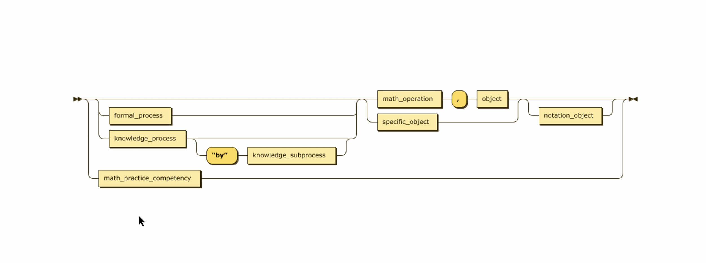

# competency_generation

Experimentation on competency formal grammar syntax rules and generation of competency data

## Tools:
[BNFgen](https://baturin.org/tools/bnfgen/) 

[Railroad Syntax Diagram Generator](https://bottlecaps.de/rr/ui#_CharCode)

# Competency Generation options

Schematron:
specific scope competencies: excludes [insert list of things that this scope doesn't contain here]

XSLT analyze-string

or

Python - read REGEX 
- lxml etree
    - XMLPullParser   

- XML Schema and [generate.DS](https://pypi.org/project/generateDS/) can be used to generate Python data structures from an XML schema and generates parsers that load an XML document into those data structures. We could use to define competency grammar, then load the competency_components.xml into. In addition, a separate file containing subclasses (stubs) is optionally generated. We could possibly use this to create scope filtering subclasses, and then we can add methods to the subclasses in order to process the contents of the XML document to generate output.

### Todo:
- create base template competency sentence structure for a specific scope, try to run it and confer with team to adjust according to validity